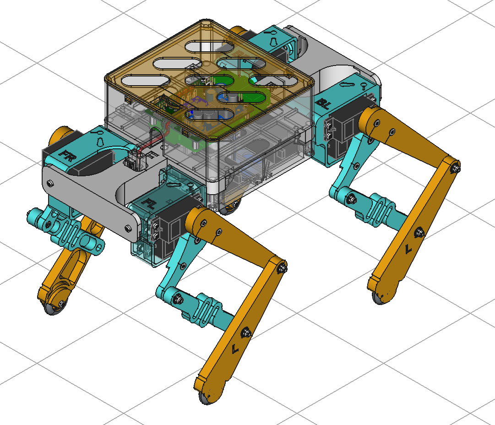

# PrintPupper  
## Release v0.2 2025 Aug 14
PrintPupper is an open-source quadruped robot that anyone can build. It is based on Pupper, developed by Stanford University, and has been redesigned to be cheaper and easier to build. With just a 3D printer and inexpensive parts, you can build a full-fledged quadruped robot with 12 joints.  
PrintPupper は誰でも作れるオープンソースの四足歩行ロボットです。スタンフォード大学の開発したPupperを元に、より安価に簡単に作れるよう再設計しました。3Dプリンタと安価な部品だけで12自由度の本格四足ロボを作れます。
  
  
  
## printpupper.com  
[https://www.printpupper.com/](https://www.printpupper.com/)  
This portal site explains the assembly procedure with detailed figs.
このポータルサイトでは組立手順を詳細な図で説明しています。
  
・3DプリンターとAmazonで容易に入手できる安価な部品だけで作れる。  
・組立手順をWebで詳細に説明。  
・FreeCAD設計データ、KiCAD基板設計データなど全てGitHubで公開。  
・オリジナル設計よりも頑丈で壊れにくい。  
・USBジョイパッド対応。  
・キャリブレーション作業がジョイパッドだけで可能。  
・RC用大容量バッテリー搭載可能で40分の連続歩行。  
・拡張性あり、改造が容易、IMU搭載が可能。  
・Raspberry Pi 3以降または、Raspberry Pi Zero 2 W での作成が可能。  
  
・Can be built using only a 3D printer and inexpensive parts readily available on Amazon.  
・Assembly instructions are explained in detail on the Web.  
・FreeCAD design data, KiCAD board design data, etc. are all available on GitHub.  
・Sturdier and less likely to break than the original design.  
・Compatible with USB joypad.  
・Calibration can be done using only the joypad.  
・Can be equipped with a large-capacity RC battery for 40 minutes of continuous walking.  
・Expandable, easy to modify, and can be equipped with an IMU.  
・Can be built with a Raspberry Pi 3 or later, or a Raspberry Pi Zero 2 W.  
  
