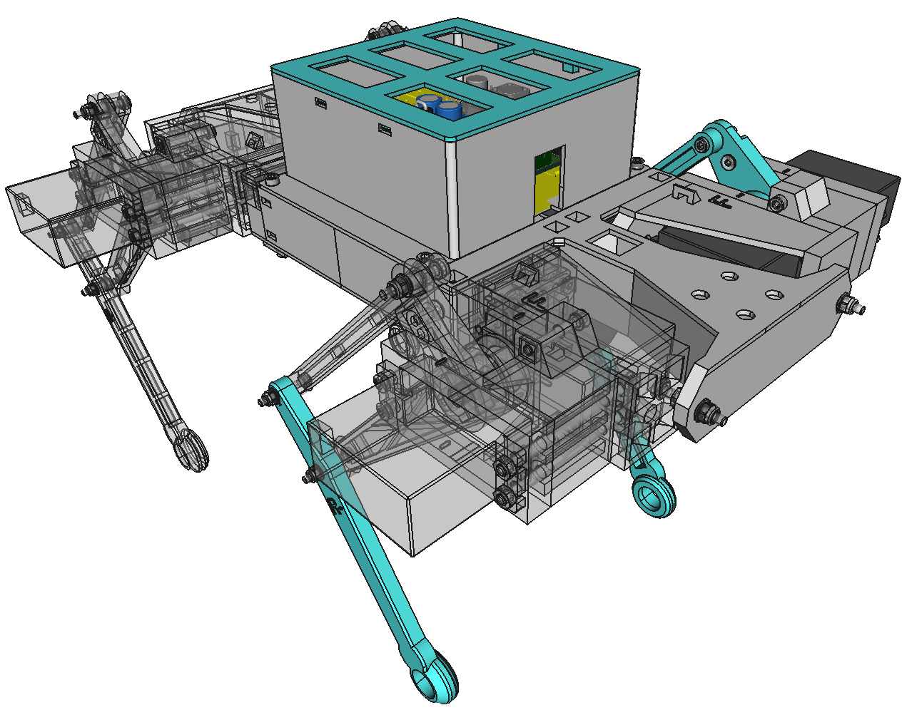

# PrintPupper  
PrintPupper is open source DIY quadruped robot, composition are 3D printed and common cheaper parts only. Based on "Pupper" developed by Stanford University, it was redesigned to be cheaper and easier to make, then no needed carbon cutting parts.  
printpupper.com は誰でも作れるオープンソースの四足歩行ロボットです。スタンフォード大学の開発したPupperを元に、より安価に簡単に作れるよう再設計しました。3DプリンタとAmazonで買える部品だけで12自由度の本格四足ロボを作れます。
カーボン切出部品など不要。設計Git公開です。組立手順を詳細に説明した動画を公開しています。
  
・3DプリンターとAmazonで容易に入手できる安価な部品だけで作れる  
・組立手順を動画チャンネルで詳細に説明  
・FreeCAD設計データ、KiCAD基板設計データなど全てGitHubで公開  
・オリジナル設計よりも頑丈で壊れにくい  
・USBジョイパッド対応 (New)  
・キャリブレーション作業がジョイパッドだけで可能 (New)  
・RC用大容量バッテリー搭載可能で30分の連続歩行  
・拡張性あり、改造が容易、IMU搭載が可能  
・RaspberryPi 3以降または、Raspberrypi Zero W での作成が可能  
## printpupper.com  
[https://www.printpupper.com/](https://www.printpupper.com/)  
This portal site explains the assembly procedure with detailed videos.  
このポータルサイトでは組立手順を詳細な動画で説明しています。  

