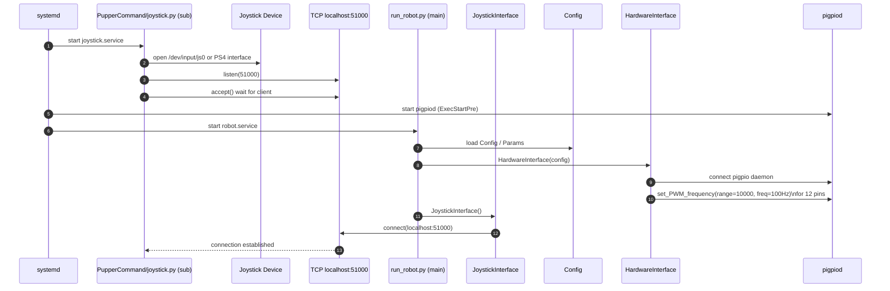

```mermaid

sequenceDiagram
autonumber
participant systemd as systemd
participant joy as PupperCommand/joystick.py (sub)
participant jsdev as Joystick Device
participant tcp as TCP localhost:51000
participant main as run_robot.py (main)
participant jif as JoystickInterface
participant cfg as Config
participant hw as HardwareInterface
participant pig as pigpiod

systemd->>joy: start joystick.service
joy->>jsdev: open /dev/input/js0 or PS4 interface
joy->>tcp: listen(51000)
joy->>tcp: accept() wait for client

systemd->>pig: start pigpiod (ExecStartPre)
systemd->>main: start robot.service

main->>cfg: load Config / Params
main->>hw: HardwareInterface(config)
hw->>pig: connect pigpio daemon
hw->>pig: set_PWM_frequency(range=10000, freq=100Hz)\nfor 12 pins
main->>jif: JoystickInterface()
jif->>tcp: connect(localhost:51000)
tcp-->>joy: connection established

```
