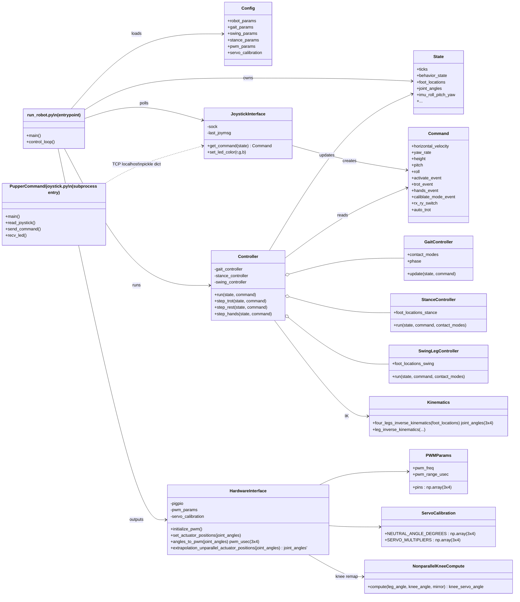

```mermaid

classDiagram
direction LR

%% =========================
%% Entry points / Processes
%% =========================
class run_robot_py["run_robot.py\n(entrypoint)"] {
  +main()
  +control_loop()
}

class joystick_py["PupperCommand/joystick.py\n(subprocess entry)"] {
  +main()
  +read_joystick()
  +send_command()
  +recv_led()
}

%% =========================
%% Command / State / Config
%% =========================
class Command {
  +horizontal_velocity
  +yaw_rate
  +height
  +pitch
  +roll
  +activate_event
  +trot_event
  +hands_event
  +caliblate_mode_event
  +rx_ry_switch
  +auto_trot
}

class State {
  +ticks
  +behavior_state
  +foot_locations
  +joint_angles
  +imu_roll_pitch_yaw
  +...
}

class Config {
  +robot_params
  +gait_params
  +swing_params
  +stance_params
  +pwm_params
  +servo_calibration
}

class PWMParams {
  +pins : np.array(3x4)
  +pwm_freq
  +pwm_range_usec
}

class ServoCalibration {
  +NEUTRAL_ANGLE_DEGREES : np.array(3x4)
  +SERVO_MULTIPLIERS : np.array(3x4)
}

%% =========================
%% Input Interface (TCP)
%% =========================
class JoystickInterface {
  -sock
  -last_joymsg
  +get_command(state) Command
  +set_led_color(r,g,b)
}

%% =========================
%% Core controller (FSM)
%% =========================
class Controller {
  -gait_controller
  -stance_controller
  -swing_controller
  +run(state, command)
  +step_trot(state, command)
  +step_rest(state, command)
  +step_hands(state, command)
}

class GaitController {
  +update(state, command)
  +contact_modes
  +phase
}

class StanceController {
  +run(state, command, contact_modes)
  +foot_locations_stance
}

class SwingLegController {
  +run(state, command, contact_modes)
  +foot_locations_swing
}

%% =========================
%% Kinematics / Geometry
%% =========================
class Kinematics {
  +four_legs_inverse_kinematics(foot_locations) joint_angles(3x4)
  +leg_inverse_kinematics(...)
}

class NonparallelKneeCompute {
  +compute(leg_angle, knee_angle, mirror) knee_servo_angle
}

%% =========================
%% Hardware Output (pigpio)
%% =========================
class HardwareInterface {
  -pigpio
  -pwm_params
  -servo_calibration
  +initialize_pwm()
  +set_actuator_positions(joint_angles)
  +angles_to_pwm(joint_angles) pwm_usec(3x4)
  +extrapolation_unparallel_actuator_positions(joint_angles) joint_angles'
}

%% =========================
%% Relationships (Main process)
%% =========================
run_robot_py --> Config : loads
run_robot_py --> State : owns
run_robot_py --> JoystickInterface : polls
run_robot_py --> Controller : runs
run_robot_py --> HardwareInterface : outputs

JoystickInterface --> Command : creates
Controller --> State : updates
Controller --> Command : reads

Controller o-- GaitController
Controller o-- StanceController
Controller o-- SwingLegController

Controller --> Kinematics : IK
HardwareInterface --> PWMParams
HardwareInterface --> ServoCalibration
HardwareInterface --> NonparallelKneeCompute : knee remap

%% =========================
%% Subprocess relationships
%% =========================
joystick_py ..> JoystickInterface : TCP localhost\npickle dict

```
