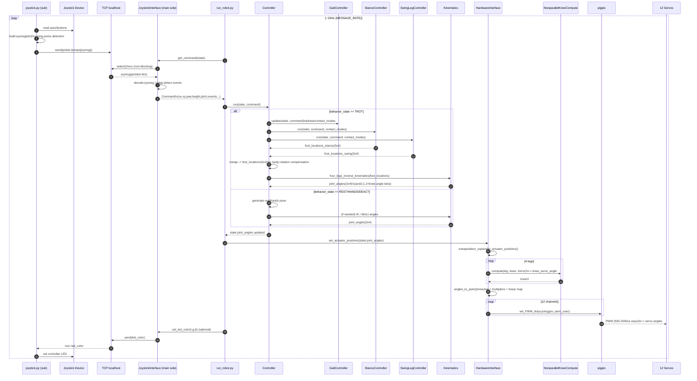

```mermaid

sequenceDiagram
autonumber
participant joy as joystick.py (sub)
participant jsdev as Joystick Device
participant tcp as TCP localhost
participant jif as JoystickInterface (main side)
participant main as run_robot.py
participant ctrl as Controller
participant gait as GaitController
participant stance as StanceController
participant swing as SwingLegController
participant kin as Kinematics
participant hw as HardwareInterface
participant knee as NonparallelKneeCompute
participant pig as pigpio
participant servos as 12 Servos

loop ~15Hz (MESSAGE_RATE)
  %% --- Subprocess reads joystick and sends joymsg ---
  joy->>jsdev: read axes/buttons
  joy->>joy: build joymsg(dict)\n+ long-press detection
  joy->>tcp: send(pickle.dumps(joymsg))

  %% --- Main process receives and converts to Command ---
  main->>jif: get_command(state)
  jif->>tcp: select()/recv (non-blocking)
  tcp-->>jif: joymsg(pickled dict)
  jif->>jif: decode joymsg / edge-detect events
  jif-->>main: Command\n(vx,vy,yaw,height,pitch,events...)

  %% --- Controller state machine ---
  main->>ctrl: run(state, command)
  alt behavior_state == TROT
    ctrl->>gait: update(state, command)\nphase/contact_modes
    ctrl->>stance: run(state, command, contact_modes)
    ctrl->>swing: run(state, command, contact_modes)
    stance-->>ctrl: foot_locations_stance(3x4)
    swing-->>ctrl: foot_locations_swing(3x4)
    ctrl->>ctrl: merge -> foot_locations(3x4)\n+ body rotation compensation
    ctrl->>kin: four_legs_inverse_kinematics(foot_locations)
    kin-->>ctrl: joint_angles(3x4)\n(axis0,1,2=knee angle beta)
  else behavior_state == REST/HANDS/DEACT
    ctrl->>ctrl: generate rest/hands pose
    ctrl->>kin: (if needed) IK / direct angles
    kin-->>ctrl: joint_angles(3x4)
  end
  ctrl-->>main: state.joint_angles updated

  %% --- Hardware output + knee remap ---
  main->>hw: set_actuator_positions(state.joint_angles)
  hw->>hw: extrapolation_unparallel_actuator_positions()
  loop 4 legs
    hw->>knee: compute(leg, knee, mirror)\n-> knee_servo_angle
    knee-->>hw: kneeX
  end
  hw->>hw: angles_to_pwm()\nneutral + multipliers + linear map
  loop 12 channels
    hw->>pig: set_PWM_dutycycle(gpio, pwm_usec)
  end
  pig-->>servos: PWM (500-2500us equiv)\n-> servo angles

  %% --- Optional LED feedback (bi-directional) ---
  main->>jif: set_led_color(r,g,b) (optional)
  jif->>tcp: send(led_color)
  tcp-->>joy: recv led_color
  joy->>jsdev: set controller LED
end

```
