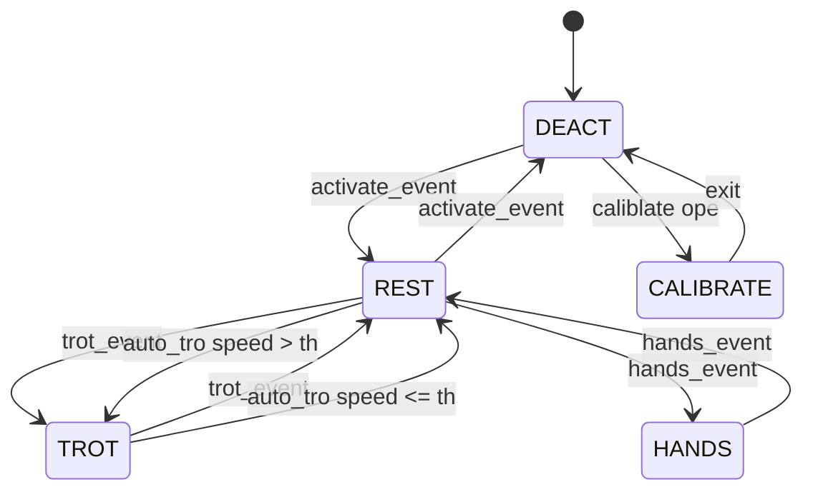

```mermaid

stateDiagram
    [*] --> DEACT

    DEACT --> REST : activate_event
    REST --> DEACT : activate_event

    REST --> TROT : trot_event
    TROT --> REST : trot_event

    REST --> HANDS : hands_event
    HANDS --> REST : hands_event

    %% auto trot
    REST --> TROT : auto_tro speed > th
    TROT --> REST : auto_tro speed <= th

    %% calibration
    DEACT --> CALIBRATE : caliblate ope
    CALIBRATE --> DEACT : exit

```
